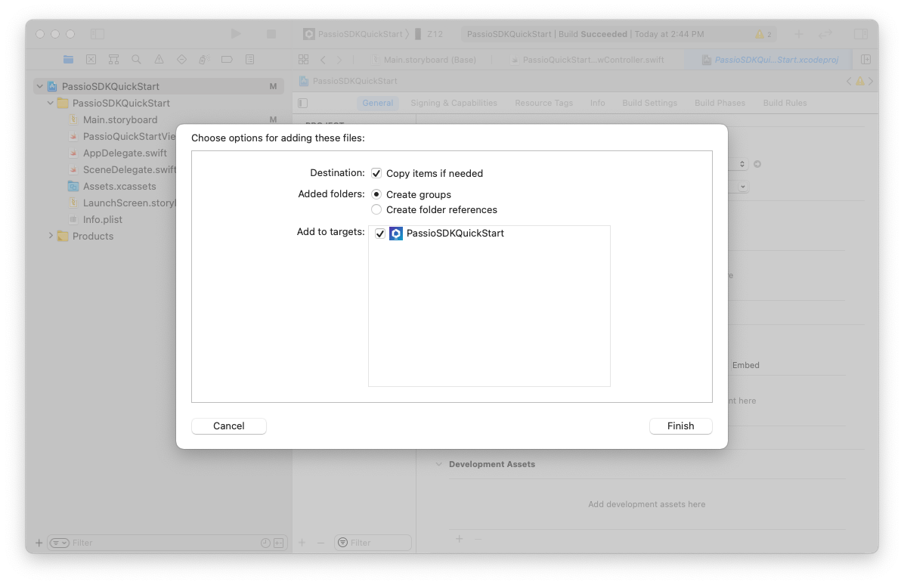
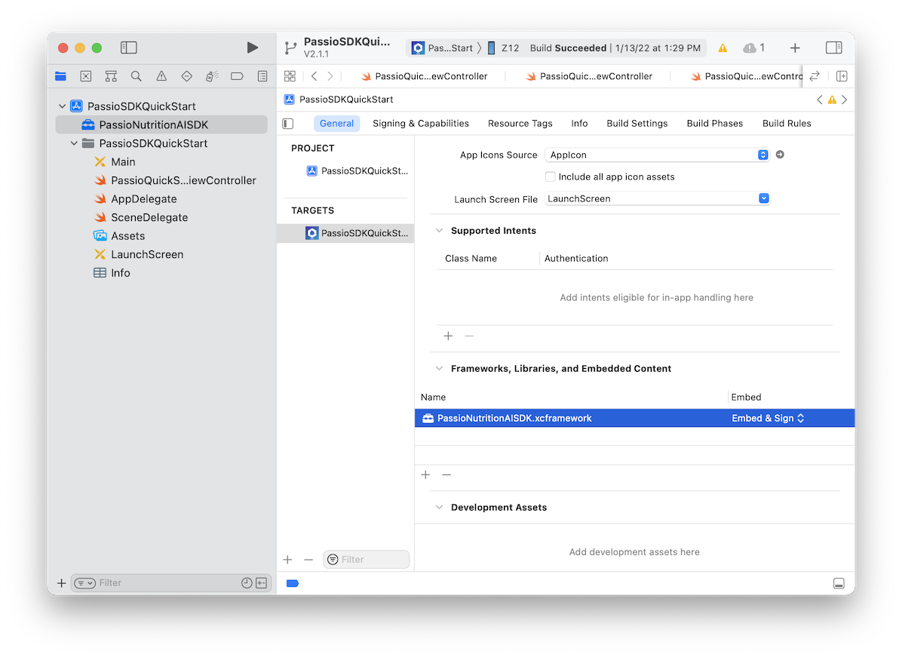

## Adding Passio SDK into your project

### Drag & drop the XCframework to your project

* Download the "PassioNutritionAISDK.xcframework.zip" file  from https://github.com/Passiolife/Passio-Nutrition-AI-iOS-SDK-Distribution/blob/main/PassioNutritionAISDK.xcframework.zip

* Unzip it and drag and drop it into your project. Make sure to select "Copy items if needed".
  
  

### Change Framework to "Embed & Sign"
* In project "General" -> "Frameworks, Libraries and Embedded Content" Change to "Embed & Sign"

 

