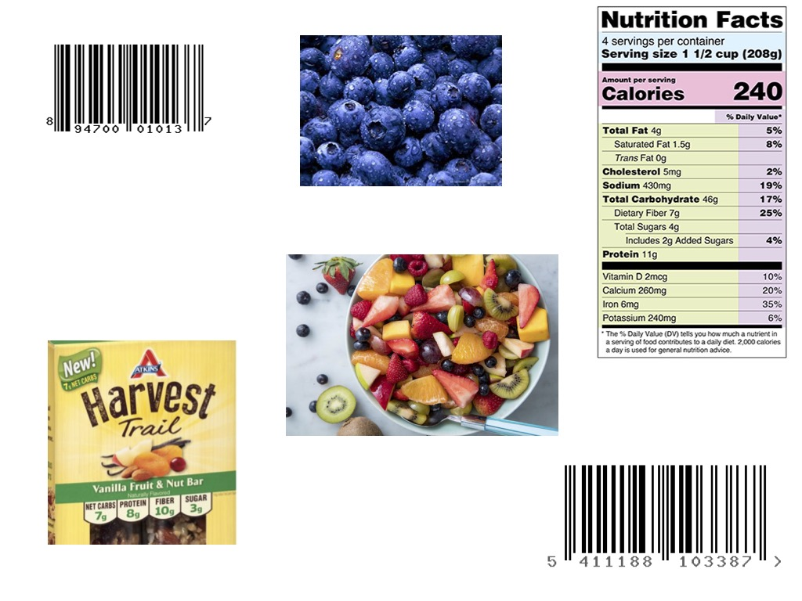

# Passio Nutrition-AI iOS SDK

## Overview

Welcome to Passio Nutrition-AI iOS SDK!

When integrated into your app the SDK provides you with food recognition and nutrition assistant technology. The SDK creates a video preview layer and outputs foods recognized by our computer vision technology in the video feed of your live camera along with nutrition data related to the recognized foods.

As the developer, you have complete control of when to turn on/off the SDK and to configure the outputs which includes: 
- food names (e.g. banana, hamburger, fruit salad, quest chocolate bar)
- lists of alternatives for recognized foods (e.g., _soy milk_ would be an alternative of a visually recognized class _milk_)
- barcodes detected on food packages
- packaged foods recognized by the text detected on food packages
- nutrition information detected on food packages via Passio's Nutrition Facts reader which returns information written in Nutrition Facts labels
- nutrition information associated with the foods
- food weight and volume for certain foods

By default the SDK does not record/store any photos or videos. Instead, as the end user hovers over a food item with his/her camera phone, the SDK recognizes and identifies food items in real time. This hovering action is only transitory/temporary while the end user is pointing the camera at a particular item and is not recorded or stored within the SDK. As a developer, you can configure the SDK to capture images or videos and store them in your app.


## BEFORE YOU CONTINUE:

1. Passio Nutrition-AI SDK added data from Open Food Facts (https://en.openfoodfacts.org/). Each food that contains data from Open Food Facts will be marked by public var isOpenFood: Bool.. In case you choose to set ```isOpenFood = true``` you agree to abide by the terms of the Open Food Facts license agreement (https://opendatacommons.org/licenses/odbl/1-0) and their terms of use (https://world.openfoodfacts.org/terms-of-use) and you will have to add to the UI the following license copy:

"This record contains information from Open Food Facts (https://en.openfoodfacts.org), which is made available here under the Open Database License (https://opendatacommons.org/licenses/odbl/1-0)"

2. To use the SDK please make sure you receive your SDK license key from Passio. The SDK WILL NOT WORK without a valid SDK key.

3. You will have to download the latest releases from the link below. The command "git clone" **WILL NOT** download the PassioNutritionAISDK.xcframework. <https://github.com/Passiolife/Passio-Nutrition-AI-iOS-SDK-Distribution/releases>. 
Download the ```PassioSDKQuickStart.zip``` or the ```PassioSDKFullDemo.zip``` and copy the ```PassioNutritionAISDK.xcframework``` to your project. Make sure you have followed the directions in the README files.

## Minimum Requirements

In order to use the PassioSDK your app needs to meet the following minimal requirements:

* The SDK will only run on iOS 13 or newer. The XCFramework is compiled for min iOS version 12.0.
* Passio SDK can only be used on a device and will not run on a simulator
* The SDK requires access to iPhone's camera
* Weight/Volume estimation will run only on iPhones with Dual Wide Camera (not on DualCamera). 
    * iPhone 11 Pro & Pro Max
    * iPhone 12 mini, Pro & pro Max
    * iPhone 13 Pro & Pro Max are not enabled for weight estimation during the Beta period.

## Try first to run the Quick Start Demo

  A fast and easy way to get started with the SDK is to test it inside of PassioSDKQuickStart Demo App included in this package. Here are the steps:
  
  1. Open the project in Xcode:
  2. Replace the SDK Key in the PassioQuickStartViewController.swift file with the license key you get from Passio
  3. Connect your iPhone and run
  4. Modify the app bundle from "com.PassioDemoApp.demo" to "com.yourcompany...."
  5. Run the demo app on your iPhone.
  6. For support, please contact support@passiolife.com

***

## Adding Passio SDK into your project

### Drag & drop the XCframework to your project

* Drag and drop the "PassioNutritionAISDK.xcframework" into your project. Make sure to select "Copy items if needed".
  
  


### Change Framework to "Embed & Sign"
* In project "General" -> "Frameworks, Libraries and Embedded Content" Change to "Embed & Sign"

 
### Edit your Info.plist

* If opening from Xcode, right click and select 'open as source code'
* To allow camera usage add:

 ```XML
`<key>>NSCameraUsageDescription</key><string>For real-time food recognition</string>`.
```

***

### Initialize and configure the SDK

1) At the top of your view controller import the PassioNutritionAISDK and AVFoundation

```swift
import PassioNutritionAISDK
import AVFoundation
```

2) Add the following properties to your view controller. 

```swift
let passioSDK = PassioNutritionAI.shared
var videoLayer: AVCaptureVideoPreviewLayer?
```

3) In viewDidLoad configure the SDK with the Key you have received form Passio. 

```swift 
override func viewDidLoad() {
        super.viewDidLoad()
        let key = "Your_PassioSDK_Key"
        //* Use the API key you received from us or request a key from [support@passiolife.com](support@passiolife.com).
        let passioConfig = PassioConfiguration(key: key)
        passioSDK.configure(passioConfiguration: passioConfig) { (status) in
            print("Mode = \(status.mode)\nmissingfiles = \(String(describing: status.missingFiles))" )
        }
    }
```

4) You will receive the PassioStatus back from the SDK.

```Swift
public struct PassioStatus {
    public internal(set) var mode: PassioSDK.PassioMode { get }
    public internal(set) var missingFiles: [PassioSDK.FileName]? { get }
    public internal(set) var debugMessage: String? { get }
    public internal(set) var activeModels: Int? { get }
}

public enum PassioMode {
    case notReady
    case isBeingConfigured
    case isDownloadingModels
    case isReadyForDetection
    case failedToConfigure
}
```

5) In `viewWillAppear` request authorization to use the camera and start the recognition:

```swift
override func viewWillAppear(_ animated: Bool) {
        super.viewWillAppear(animated)
        if AVCaptureDevice.authorizationStatus(for: .video) == .authorized {
            startFoodDetection()
        } else {
            AVCaptureDevice.requestAccess(for: .video) { (granted) in
                if granted {
                    DispatchQueue.main.async {
                        self.startFoodDetection()
                    }
                } else {
                    print("The user didn't grant access to use camera")
                }
            }
        }
    }

  ```

6) Add the method `startFoodDetection()`  

```swift
  func startFoodDetection() {
        setupPreviewLayer()
        passioSDK.startFoodDetection(foodRecognitionDelegate: self) { (ready) in
            if !ready {
                print("SDK was not configured correctly")
            }
        }
    }
```


7) Add the method `setupPreviewLayer`:

```swift
 // MARK: PassioSDK: setup PreviewLayer
    func setupPreviewLayer() {
        guard videoLayer == nil else { return }
        if let videoLayer = passioSDK.getPreviewLayer() {
            self.videoLayer = videoLayer
            videoLayer.frame = view.bounds
            view.layer.insertSublayer(videoLayer, at: 0)
        }
    }
```

8) Stop Food Detection in `viewWillDisappear`:

  ```swift
 override func viewWillDisappear(_ animated: Bool) {
        super.viewWillDisappear(animated)
        passioSDK.stopFoodDetection()
        videoLayer?.removeFromSuperlayer()
        videoLayer = nil
    }
  ```

9) Implement the delegate `FoodRecognitionDelegate`:

  ```swift
extension PassioQuickStartViewController: FoodRecognitionDelegate {

    func recognitionResults(candidates: FoodCandidates?,
                            image: UIImage?) {
        if let detectedCandidates = candidates?.detectedCandidates {
           detectedCandidates.forEach {
                if let pidAtt = self.passioSDK.lookupPassioIDAttributesFor(passioID: $0.passioID) {
                    print("Food name =\(pidAtt.name)")
                }
            }
        }
    }

}
```


## To see all the capabilities of the SDK run the PassioSDKFullDemo

Start by adding your key to the PassioExternalConnector class
```swift
class PassioExternalConnector 

var passioKeyForSDK: String {
        "YourPassioSDKKey"
    }

```

Review the  RotationViewController super class is contains all the elements for adding the PassioNutritionAISDK to a view controller.

Note: If you use the SDK only in one view you could move all the code from viewDidAppear to viewWillAppear. 

It is also containing the code to support device rotations. 

```swift
import UIKit
import AVFoundation
import PassioNutritionAISDK

class RotationViewController: UIViewController {

    let passioSDK = PassioNutritionAI.shared
    var volumeDetectionMode = VolumeDetectionMode.auto
    var videoLayer: AVCaptureVideoPreviewLayer? {
        didSet {
            backgroundImage?.fadeOut(seconds: 0.3)
            // backgroundImage?.isHidden = videoLayer == nil ? false : true
        }
    }

    override func viewWillAppear(_ animated: Bool) {
        super.viewWillAppear(animated)
        NotificationCenter.default.addObserver(self, selector: #selector(deviceRotated),
                                               name: UIDevice.orientationDidChangeNotification,
                                               object: nil)
        if AVCaptureDevice.authorizationStatus(for: .video) == .authorized { // already authorized
            setupVideoLayer()
            startDetection()
        } else {
            AVCaptureDevice.requestAccess(for: .video) { (granted) in
                if granted { // access to video granted
                    DispatchQueue.main.async {
                        self.setupVideoLayer()
                        self.startDetection()
                    }
                } else {
                    print("The user didn't grant access to use camera")
                }
            }
        }
    }

    override func viewWillDisappear(_ animated: Bool) {
        super.viewWillDisappear(animated)
        backgroundImage.fadeIn(seconds: 0.2)
        NotificationCenter.default.removeObserver(self,
                                                  name: UIDevice.orientationDidChangeNotification,
                                                  object: nil)
        stopDetection()
        videoLayer?.removeFromSuperlayer()
        videoLayer = nil
        passioSDK.removevideoLayer()
    }

    func startDetection() {

    }

    func stopDetection() {

    }

    func setupVideoLayer() {
        guard videoLayer == nil else { return }
        print("setupVideoLayer volumeDetectionMode  == \(volumeDetectionMode)" )
        if let vLayer = passioSDK.getPreviewLayerWithGravity(volumeDetectionMode: volumeDetectionMode,
        videoGravity: .resizeAspectFill) {
            videoLayer = vLayer
            vLayer.frame = view.bounds
            view.layer.insertSublayer(vLayer, at: 0)
        }
    }

}

```

### Using the full demo app point at parts of the image below to test recognition
* Food (non packaged)
* Barcode
* Packaged food
* Nutrition facts 



<sup>Copyright 2022 Passio Inc</sup>
